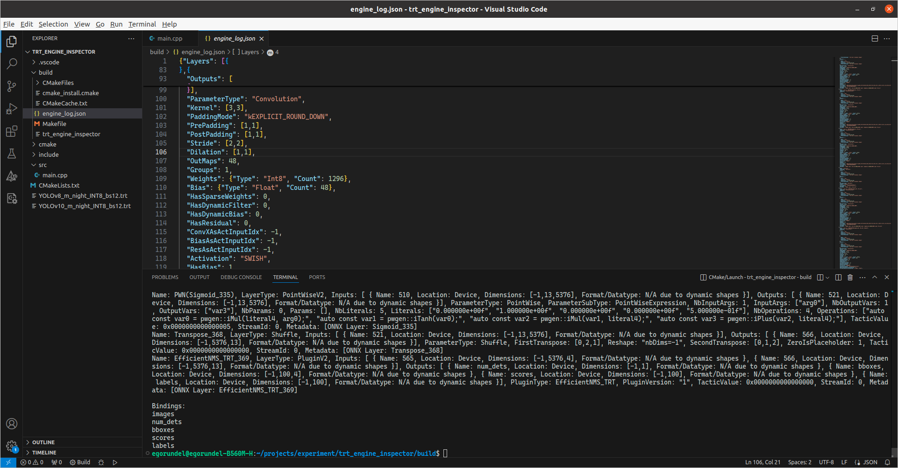

# TensorRT Engine Inspector (layers)

## Description

It looks at the layers in the engine and provides information about them. However, in order to have as much information about the layers as possible, when creating the engine, use:
1. if you are building the engine from C++ code 
```cpp
config->setProfilingVerbosity(nvinfer1::ProfilingVerbosity::kDETAILED);
```  
or  

2. if you are building the engine through `trtexec`
```shell
profilingVerbosity=detailed
```

## Change this line for your engine

```cpp
// Load the TensorRT engine file
ifstream engineFile("../engine.trt", ios::binary);
```

## How to launch?

```shell
# download repository
git clone https://github.com/Egorundel/tensorrt-engine_layers_inspector_cpp.git

# go to downloaded repository
cd tensorrt-engine_layers_inspector_cpp

# create `build` folder and go to her
mkdir build && cd build

# cmake 
cmake ..

# build it
cmake --build .
# or
make -j$(nproc)

# launch
./tensorrt-engine_layers_inspector_cpp
```

## Screenshot of work



### Tested on:  

**TensorRT Version**: 8.6.1.6  
**NVIDIA GPU**: RTX 3060  
**NVIDIA Driver Version**: 555.42.02  
**CUDA Version**: 11.1  
**CUDNN Version**:  8.0.6  
